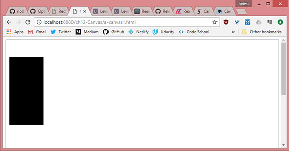
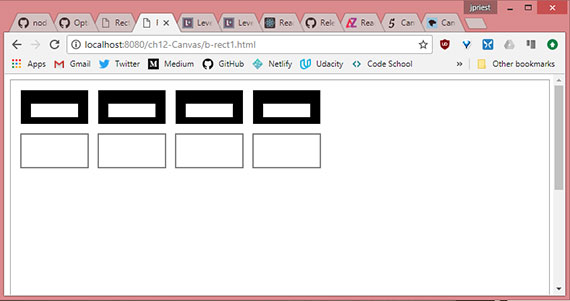
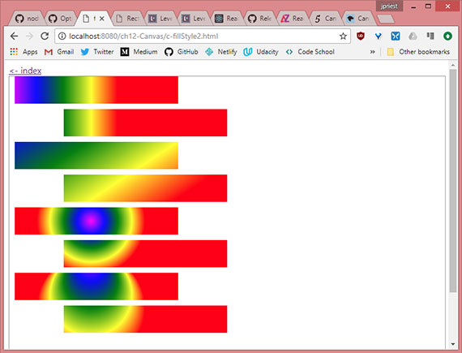
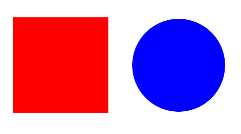
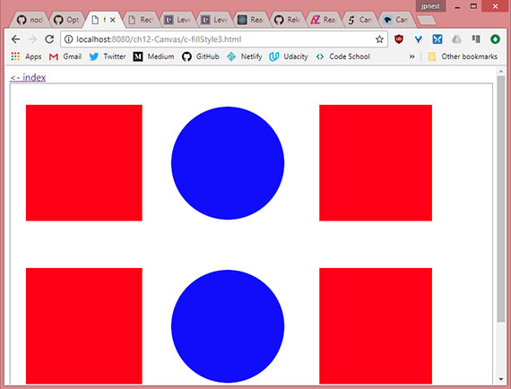
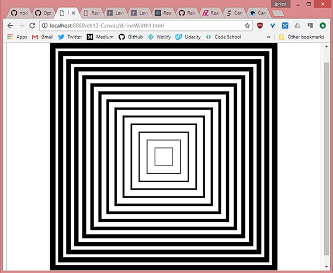

<!-- markdownlint-disable MD022 MD024 MD032 -->
# Chapter 12 - HTML5 Canvas & SVG

Notes from [Programming in HTML5 with JavaScript & CSS3 Training Guide](https://www.amazon.com/Training-Guide-Programming-JavaScript-Microsoft/dp/0735674388) by Glenn Johnson.

This is part of my study material for passing Microsoft's [Exam 70-480: Programming in HTML5 with JavaScript & CSS3](https://www.microsoft.com/en-us/learning/exam-70-480.aspx) certification exam.

---

Prior to HTML5 we had to rely on something like Adobe Flash for drawing on a webpage. Now we have the ability to draw in HTML5 by using the `<canvas>` element.

We can display Scalable Vector Graphics by using the `<svg>` element. SVG is a language by which to define two-dimensional graphics in XML. The XML can then be rendered by the browser using the `<svg>` tag. Although you could learn and write SVG by hand, you will most likely use an image editor to create SVG graphics. The benefits of SVG is that they're scalable.

This lesson presents the `<canvas>` element and demonstrates drawing on the canvas. Then the lesson covers `<svg>` from an implementation perspective rather than from a drawing perspective.

# 1. Drawing with canvas
The only significant attributes that `<canvas>` has are the `height` and `width` attributes. The content you place in the `<canvas>` element is displayed if the browser doesn't support the canvas element.

```html
<canvas id="myCanvas" width="800" height="600">
    You need a browser that supports HTML5!
</canvas>
```

The `<canvas>` element is invisible by default so we apply the following.

```css
canvas {
    border: 1px solid #999;
}
```

## 2. Canvas element reference
The `<canvas>` element exposes an abundance of functionality through its canvas context, which is accessible using JavaScript. The element provides the following members.

- **height** Property that sets or gets the height of the canvas
- **width** Property that sets or gets the width of the canvas
- **getContext()** Method that accepts a parameter of `2d` and returns a `CanvasRenderingContext2D` object that represents the canvas context
- **toDataUrl()** Method that creates a URL that can be used with an element that requires an image URL, such as the `` element

## 3. CanvasRenderingContext2D context object reference
The `<canvas>` element is simply a graphics container; the context object that is returned from the `getContext` method is used to draw on the canvas. 

The following is a list of the context object's members.

- **addColorStop()** Method to set the colors and stop positions in a gradient object
- **arc()** Method to create an arc/curve
- **actTo()** Method to create an arc/curve between two tangents
- **beginPath()** Method to start a path or reset the current path
- **bezierCurveTo()** Method to create a cubic Bezier curve
- **clearRect()** Method to clear a given rectangle
- **clip()** Method to clip a region of any shape and size from the original canvas
- **closePath()** Method to create a path from the current point back to the starting point
- **createImageData()** Method to create a new, blank ImageData object
- **createLinearGradient()** Method to create a linear gradient
- **createPattern()** Method to repeat a specified element in a specified direction
- **createRadialGradient()** Method to create a radial/circular gradient
- **data** Property that gets an `ImageData` object that contains the image data
- **drawImage()** Method to draw an image, canvas, or video onto the canvas
- **fill()** Method to fill the drawing path
- **fillRect()** Method to draw a filled rectangle
- **fillStyle** Property that sets or gets the color, gradient, or pattern used to fill the drawing
- **fillText()** Method to draw filled text on the canvas
- **font** Property that sets or gets the font properties for text content
- **getImageData()** Method to get an `ImageData` object that copies the pixel data for the specified rectangle on a canvas
- **globalAlpha** Property that sets or gets the current alpha or transparency value fo the drawing
- **globalCompositeOperation** Property that sets or gets how a new image is drawn onto an existing image
- **isPointInPath()** Method that returns `true` if the specified point is in the current path
- **lineCap** Property that sets or gets the style of the end caps for a line
- **lineJoin** Property that sets or gets the type of corner to create when two lines meet
- **lineTo()** Method that adds a new point and creates a line from that point to the last specified point in the canvas
- **lineWidth** Property that sets or gets the current line width
- **measureText()** Method that gets an object that contains the width of the specified text
- **miterLimit** Property that sets or gets the maximum miter length
- **moveTo()** Method that moves the path to the specified point in the canvas without creating a line
- **putImageData()** Method that puts the image data from a specified `ImageData` boject back onto the canvas
- **quadraticCurveTo()** Method that creates a quadratic Bezier curve
- **rect()** Method that creates a rectangle
- **restore()** Method that pops the previously saved context from the stack
- **rotate()** Method that rotates the current drawing
- **save()** Method that pushes the state of the current context onto a stack
- **scale()** Method that scales the current drawing bigger or smaller
- **setTransform()** Method that resets the current transform to the identity matrix and then call the `transform()` method
- **shadowBlur** Property that sets or gets the blur level setting to use for shadows
- **shadowColor** Property that sets or gets the color setting to use for shadows
- **shadowOffsetX** Property that sets or gets the horizontal distance setting of the shadow from the shape
- **shadowOffsetY** Property that sets or gets the vertical distance setting of the shadow  from the shape
- **stroke()** Method to draw the path you have defined
- **strokeRect()** Method to draw a rectangle without fill
- **strokeStyle** Property that sets or gets the color, gradient, or pattern used for strokes
- **strokeText()** Method that draws text on the canvas without fill
- **textAlign** Property that sets or gets the alignment setting for text content
- **textBaseline** Property that sets or gets the text baseline setting used when drawing text
- **transform()** Method that replaces the transformation matrix setting for the drawing
- **translate()** Method that remaps the (0,0) position on the canvas

## 4. Implementing the canvas
When working with the `canvas` object, you must get a reference to the canvas context. This can be accomplished by using the `getContext()` method, which accepts a parameter.

Currently the values for the parameter are `2d` and `webgl`. WebGL focuses on more advanced three-dimensional drawing but this lesson will focus on the more mature `2d` parameter which returns a `CanvasRenderingContext2D` object. This object will be referred to as the _context_ object.

```js
$(document).ready(function() {
    drawSomething();
});

function drawSomething() {
    var canvas = document.getElementById('myCanvas');
    var ctx = canvas.getContext('2d');
    ctx.fillRect(10, 50, 100, 200);
}
```

In this example, `canvas` is a reference to the `<canvas>` element whose `id` is `myCanvas`. After that, `ctx` is set to reference the `context` object, with which you can start drawing.

The coordinates of the drawing surface are represented as `x`, `y` where 0,0 is the upper-left corner of the canvas

[](assets/images/full-size/chap12-1.png)
**Example:** <a href="https://james-priest.github.io/node_samples/ch12-Canvas/a-canvas1.html" target="_blank">https://james-priest.github.io/node_samples/ch12-Canvas/a-canvas1.html</a>

### Quick check
- What is the proper parameter to pass to the `getContext` method on the canvas to create two-dimensional drawings?

### Answer
- `2d`

## 5. Drawing rectangles
The methods for creating rectangles accept four parameters. The first two are the x and y locations of the upper-left corder. The last two parameters represent the width and height of the rectangle. You can create rectangles by using one of the following methods.

- **clearRect(x, y, w, h)** Clear the specified rectangular area.
- **fillRect(x, y, w, h)** Draw a filled rectangular area.
- **strokeRect(x, y, w, h)** Draw an unfilled rectangular area.

The following code demonstrates this.

```js
$(document).ready(function() {
    drawSomething();
});

function drawSomething() {
    var canvas = document.getElementById('myCanvas'),
        ctx = canvas.getContext('2d'),
        offset = 15,
        clearOffset = 30,
        pushDownOffset = 10,
        height = 50,
        width = 100,
        count = 4;

    for (var i = 0; i < count; i++) {
        ctx.fillRect(i * (offset + width) + offset, offset, width, height);

        ctx.clearRect(i * (offset + width) + (clearOffset / 2) + offset,
            offset + (clearOffset / 2) + (pushDownOffset /2),
            width - clearOffset, height - clearOffset);

        ctx.strokeRect(i * (offset + width) + offset,
            (2 * offset) + height, width, height);
    }
}
```

In this example, the `fillRect()` method is used to create four rectangles. Each is spaced horizontally by the offset amount. Next the `clearRect()` method is used to clear a rectangular area that is inside the filled-in area. Finally, the `strokeRect()` method is used to create a second row, but these rectangles are not filled in.

[](assets/images/full-size/chap12-1.png)
**Example:** <a href="https://james-priest.github.io/node_samples/ch12-Canvas/b-rect1.html" target="_blank">https://james-priest.github.io/node_samples/ch12-Canvas/b-rect1.html</a>

So, drawing on the canvas does indeed require knowledge of JavaScript and the canvas context object.
<!--
## 6. Configuring drawing state
In the previous example, we did not set the fill color for `fillRect()` or the line thickness and color for `strokeRect()`. The canvas context has properties we can set before calling any of the drawing methods.

After we change a property, the new value is used for th subsequent drawing statements.

## 7. Setting fillStyle
We can set fill style to CSS color, gradient, or pattern

## 8. fillstyle: CSS color
This creates a solid color fill based on valid CSS color value such as a named color (black, red, etc.), hex value(#FF0000), or css function (rgb(), rgba(), hsl(), hsla()).

```js
function drawUsingCssColor() {
    // var canvas = document.getElementById('myCanvas');
    var canvas = document.createElement('canvas'),
        ctx = canvas.getContext('2d'),
        offset = 10,
        size = 50;

    canvas.id = 'myCanvas';
    canvas.width = 800;
    canvas.height = 600;
    document.body.appendChild(canvas);

    ctx.fillStyle = "red";
    ctx.fillRect(offset + (0 * (offset + size)), offset, size, size);
    ctx.fillRect(offset + (1 * (offset + size)), offset, size, size);

    ctx.fillStyle = "#00FF00";
    ctx.fillRect(offset + (2 * (offset + size)), offset, size, size);
    ctx.fillRect(offset + (3 * (offset + size)), offset, size, size);

    ctx.fillStyle = "rgba(0, 0, 255, 0.25)";
    ctx.fillRect(offset + (4 * (offset + size)), offset, size, size);
    ctx.fillRect(offset + (5 * (offset + size)), offset, size, size);
}
```

In this example, `fillStyle` is set to "red" and two rectangles are created. Next, `fillStyle` is set to green, using "#00FF00" and two rectangles are created. Finally, `fillStyle` is set to blue with an opacity of 25 percent and two rectangles are created.

[](assets/images/full-size/chap12-3.png)
**Example:** <a href="https://james-priest.github.io/node_samples/ch12-Canvas/c-fillStyle1.html" target="_blank">https://james-priest.github.io/node_samples/ch12-Canvas/c-fillStyle1.html</a>

## 9. fillstyle: Gradient
A `CanvasGradient` object that is created by the context's `createLinearGradient()` or `createRadialGradient()` method to create a gradient fill.

The `createLinearGradient()` method accepts the `x` and `y` values of two points that are used to create a linear gradient, for example, `createLinearGradient(x0, y0, x1, y1)`.

The `createRadialGradient()` accepts the `x` and `y` center and the radius of the two circles, for example, `createRadialGradient(x0, y0, x1, y1, r1)`.

After the gradient object is created, call its `addColorStop` method to specify that a color is set at a location on the gradient. The `addColorStop` function takes two parameters; the first is the location, which is a value between 0 and 1 where 0 is the beginning of the gradient and 1 is the end of the gradients, and the second parameter is the color value.

```js
function drawUsingCssColor() {
    // var canvas = document.getElementById('myCanvas');
    var canvas = document.createElement('canvas'),
        ctx = canvas.getContext('2d'),
        gradient = '',
        x0 = 0,
        y0 = 0,
        r0 = 0,
        x1 = 200,
        y1 = 0,
        r1 = 100,
        width = 300,
        height = 50,
        offset = 10;

    canvas.id = 'myCanvas';
    canvas.width = 800;
    canvas.height = 600;
    document.body.appendChild(canvas);

    gradient = ctx.createLinearGradient(x0, y0, x1, y1);
    addColorStops(gradient);
    ctx.fillStyle = gradient;
    ctx.fillRect(10, 0 * (height + offset), width, height);
    ctx.fillRect(100, 1 * (height + offset), width, height);

    y1 = 300;
    gradient = ctx.createLinearGradient(x0, y0, x1, y1);
    addColorStops(gradient);
    ctx.fillStyle = gradient;
    ctx.fillRect(10, 2 * (height + offset), width, height);
    ctx.fillRect(100, 3 * (height + offset), width, height);

    x0 = x1 = width / 2;
    y0 = y1 = 4 * (height + offset) + (height / 2);
    gradient = ctx.createRadialGradient(x0, y0, r0, x1, y1, r1);
    addColorStops(gradient);
    ctx.fillStyle = gradient;
    ctx.fillRect(10, 4 * (height + offset), width, height);
    ctx.fillRect(100, 5 * (height + offset), width, height);

    y0 = 5 * (height + offset) + (height / 2);
    y1 = y0 + 100;
    gradient = ctx.createRadialGradient(x0, y0, r0, x1, y1, r1);
    addColorStops(gradient);
    ctx.fillStyle = gradient;
    ctx.fillRect(10, 6 * (height + offset), width, height);
    ctx.fillRect(100, 7 * (height + offset), width, height);
}

function addColorStops(gradient) {
    gradient.addColorStop('0', 'magenta');
    gradient.addColorStop('.25', 'blue');
    gradient.addColorStop('.50', 'green');
    gradient.addColorStop('.75', 'yellow');
    gradient.addColorStop('1.0', 'red');
}
```

This example code displays two rectangles for each test, in which the second rectangle is offset from the first rectangle, so you can see how the gradient is rendered relative to the canvas, not the rectangle.

[](assets/images/full-size/chap12-4.png)
**Example:** <a href="https://james-priest.github.io/node_samples/ch12-Canvas/c-fillStyle2.html" target="_blank">https://james-priest.github.io/node_samples/ch12-Canvas/c-fillStyle2.html</a>

The first pair of rectangles demonstrates a horizontal linear gradient when y0 and y1 are equal.

The second pair of rectangles shows what happens when y1  is different from y0. In this example, if you draw a line from x0, y0 to x1, y.1, the line will be angled downward. The gradient is rendered along this line and displays as a diagonal linear gradient.

The third pair of rectangles illustrates the radial gradient when x0=x1 and y0=y1, but  r0 us set to zero when r1 is set to 100. Becasue both points are the same, the radial gradient is circular. Because r0 is zero, the gradient starts in the center. The gradient ends at r1, which is set to 100.

The last pair of rectangles shows what happens when the two points are not the same. In this case, x0 and x1 are the same, but y0 and y1 are different, which produces a non-circular gradient.

## 10. fillstyle: Pattern
A `CanvasPattern` object that is created by using the context's `createPattern()` method and creates a pattern fill. The `createPattern` method takes an image parameter and a direction parameter. The image is a reference to an `` element, and the direction is a string containing `no-repeat`, `repeat-x`, `repeat-y`, or `repeat`.



By using the image above, the following code creates a pattern that is assigned to the `fillStyle` property.

```js
function drawPattern() {
    // var canvas = document.getElementById('myCanvas');
    var canvas = document.createElement('canvas'),
        ctx = canvas.getContext('2d');

    canvas.id = 'myCanvas';
    canvas.width = 800;
    canvas.height = 600;
    document.body.appendChild(canvas);

    // create new image object to use as pattern
    var img = new Image();
    img.src = "assets/images/shapes.png";
    img.onload = function() {
        // create pattern
        var ptrn = ctx.createPattern(img, 'repeat');
        ctx.fillStyle = ptrn;
        ctx.fillRect(0, 0, 700, 500);
    };
}
```

In this example, instead of creating an `` element, the image is dynamically created and its source is set to the shapes.png file. Next, the `onload` event of the image is subscribed to that creates the pattern on the canvas after shapes.png is loaded.

[](assets/images/full-size/chap12-4.png)
**Example:** <a href="https://james-priest.github.io/node_samples/ch12-Canvas/c-fillStyle3.html" target="_blank">https://james-priest.github.io/node_samples/ch12-Canvas/c-fillStyle3.html</a>

## 11. Setting lineWidth
The `lineWidth` property specifies the thickness of any line you draw. The following code example draws rectangles by using different `lineWidth` settings.

```js
function drawPattern() {
    // var canvas = document.getElementById('myCanvas');
    var canvas = document.createElement('canvas'),
        ctx = canvas.getContext('2d'),
        offset = 40,
        width = 5,
        height = 5,
        i = 0,
        centerX = 400,
        centerY = 300;

    canvas.id = 'myCanvas';
    canvas.width = 800;
    canvas.height = 600;
    document.body.appendChild(canvas);

    for( i = 1; i < 15; i++) {
        ctx.lineWidth = i;
        ctx.strokeRect(centerX - (width / 2) - (i * offset / 2),
            centerY - (height / 2) - (i * offset / 2),
            width + (i * offset), height + (i * offset));
    }
}
```

In this example, `lineWidth` is changed on each iteration of the `for` loop; the drawn rectangle starts small and gets larger with each iteration.

[](assets/images/full-size/chap12-6.png)
**Example:** <a href="https://james-priest.github.io/node_samples/ch12-Canvas/d-lineWidth1.html" target="_blank">https://james-priest.github.io/node_samples/ch12-Canvas/d-lineWidth1.html</a>
-->