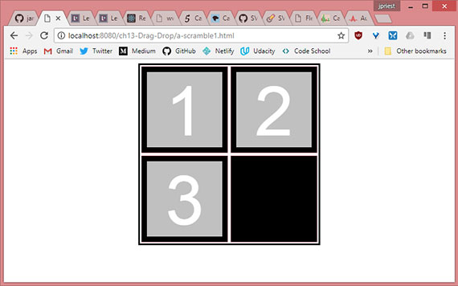
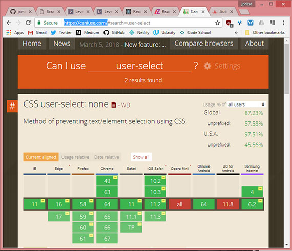
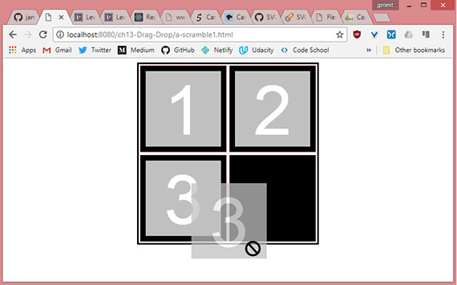
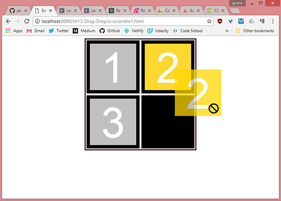
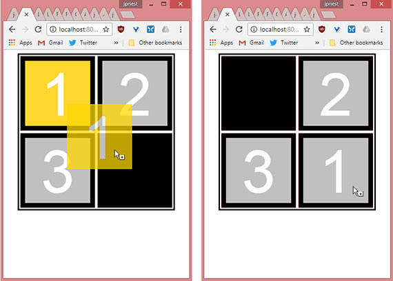

<!-- markdownlint-disable MD022 MD024 MD032 -->
# Chapter 13 - Drag & Drop

Notes from [Programming in HTML5 with JavaScript & CSS3 Training Guide](https://www.amazon.com/Training-Guide-Programming-JavaScript-Microsoft/dp/0735674388) by Glenn Johnson.

This is part of my study material for passing Microsoft's [Exam 70-480: Programming in HTML5 with JavaScript & CSS3](https://www.microsoft.com/en-us/learning/exam-70-480.aspx) certification exam.

---

Prior to HTML5, the ability to use drag and drop operations was possible only with certain browsers and was typically implemented by using a third-party library such as jQuery.

Now Drag and drop is a first-class citizen of HTML5. You might still use jQuery for other functionality but it's not required for drag and drop.

## 1. Dragging and dropping
Making drag and drop part of HTML5 means that you can get browser compatibility and browser integration. This can even extend to integration with the operating system.

To illustrate the drag and drop technique, consider the following HTML page, which defines a large square container inside it.

```html
<!DOCTYPE html>
<html lang="en">
<head>
    <meta charset="UTF-8">
    <meta name="viewport" content="width=device-width, initial-scale=1.0">
    <meta http-equiv="X-UA-Compatible" content="ie=edge">
    <title>Scramble 1</title>
    <link rel="stylesheet" href="a-scramble.css">
</head>
<body>
    <div id="container">
        <div id="hole1" class="hole"><div id="item1" class="item">1</div></div>
        <div id="hole2" class="hole"><div id="item2" class="item">2</div></div>
        <div id="hole3" class="hole"><div id="item3" class="item">3</div></div>
        <div id="hole4" class="hole"></div>
    </div>

    <script src="https://code.jquery.com/jquery-3.3.1.slim.min.js" 
    integrity="sha256-3edrmyuQ0w65f8gfBsqowzjJe2iM6n0nKciPUp8y+7E=" 
    crossorigin="anonymous"></script>
    <script src="a-scramble1.js"></script>
</body>
</html>
```

This HTML document contains a `<div>` element whose `id` is called `container`. Inside the container are four `<div>` elements that are "holes" which can contain an item. The first three are populated.

The CSS uses flexbox for centering and contains the following rules.

```css
body {
    display: flex;
    justify-content: center;
}
#container {
    border: solid;
    width: 332px;
    height: 332px;
    display: flex;
    flex-wrap: wrap;
    align-items: center;
    justify-content: space-around;
}
.hole {
    background-color: black;
    border: 1px pink solid;
    width: 160px;
    height: 160px;
    display: flex;
    align-items: center;
    justify-content: center;
}
.item {
    font-size: 128px;
    font-family: Arial, Helvetica, sans-serif;
    width: 140px;
    height: 140px;
    background-color: #C0C0C0;
    color: #FFF;
    text-align: center;
    user-select: none;
}
```

The `body` rule centers the container `<div>` horizontally on the page. The `#container` rule sets flexbox display to center and align each hole (`<div id="hole">`).

The rules under `.hole` set flexbox display to center each item element (`<div id="item">`) within each hole. The final rule is for the items and it sets a gray square with a large, centered number. The last part of the style sets `user-select: none;` to keep the user from accidentally selecting the text when trying to do a drag.

[](assets/images/full-size/chap13-1.png)<br>
**Live sample:** <a href="https://james-priest.github.io/node_samples/ch13-Drag-Drop/a-scramble1.html" target="_blank">https://james-priest.github.io/node_samples/ch13-Drag-Drop/a-scramble1.html</a>

## 2. Browser support
There are two tools I use to make sure the code I write works in as many browsers and platforms as possible. In other words, I get cross-browser compliance and as wide a coverage as possible for the CSS, JavaScript, and HTML5 features I use.

The two tools are:

- Can I Use... ([https://caniuse.com/](https://caniuse.com/))
- CSS Autoprefixer ([https://autoprefixer.github.io/](https://autoprefixer.github.io/))

## 3. Can I Use
This is a brilliant tool that allows you to search for any HTML, JavaScript or CSS feature and see what the current browser coverage is on the feature. This allows you to then make an informed decision on whether to use the feature as is, use it with a polyfill and/or autoprefix, or to find a separate way altogether to implement the functionality.

For instance, we have a CSS rule that implements `user-select: none;`. If I then go to http://caniuse.com, I can get all sorts of information on that feature.

[](assets/images/full-size/chap13-3.png)

Here I see all the browser that currently support the feature along with the version number that began support for it. This includes IE11, Edge16+, Firefox58+, Chrome64+, etc. Additionally, I can hover over any one of the browser boxes to see support notes, release date, and market share to get the percentage of users using that particular platform!

The information I find **really useful** though are the statistics on the right hand side of the page. Here we see that globally my `user-select` feature will be supported in 87.23% of all browser and 97.51% of browsers domestically.

The data that's particularly interesting are the _unprefixed_ numbers. This shows we'll only have 57.58% & 45.56% browser support, respectively, without including autoprefixing.

This means we'll effectively lose half our user-base if we don't autoprefix our CSS.

## 4. CSS Autoprefixing
So, what's autoprefixing? That brings us to tool #2.

Autoprefixing is the process of using browser-specific css to ensure a particular feature is rendered properly on that platform.

Take a look at the interface of CSS Autoprefixer.

[](assets/images/full-size/chap13-4.png)

The way it works is, we copy our CSS into the source container and the CSS prefixed output is displayed in the output container.  We can then copy and paste this back into our css file.

For the record, this is the manual way of achieving this. There are many pre and post processor solutions that will do this for you automatically, but these require installation and configuration. For now, the quick and dirty solution is to simply copy and paste.

As you can see, `user-select: none;` outputs four different rules or declarations to be compliant across various browsers.

Using the new CSS ensures the feature functionality will jump back up from 57 & 45 percent to 87 and 97 percent, respectively.

The final step, once we're done working with our CSS, is to copy the contents of our entire CSS into the source container in order to get a finalized output copy.

For purposes of these notes I will keep the CSS simple and unprefixed.

## 5. Dragging
To specify to the browser that an element can be dragged, use the `draggable` attribute. It has three valid values: `true`, `false`, and `auto`. For most browsers `auto` is the default which means the browser decides whether the element should be draggable. For example, the `` element is usually draggable by default, but a `<div>` is not.

In this HTML sample the item is a `<div>` element, and it's not draggable by default so we need to add the draggable attribute.

```html
<div id="container">
    <div id="hole1" class="hole">
        <div id="item1" draggable="true"  class="item">1</div>
    </div>
    <div id="hole2" class="hole">
        <div id="item2" draggable="true"  class="item">2</div>
    </div>
    <div id="hole3" class="hole">
        <div id="item3" draggable="true"  class="item">3</div>
    </div>
    <div id="hole4" class="hole"></div>
</div>
```

After adding the `draggable` attribute to the items, you can drag them.

[](assets/images/full-size/chap13-2.png)<br>
**Live sample:** <a href="https://james-priest.github.io/node_samples/ch13-Drag-Drop/a-scramble2.html" target="_blank">https://james-priest.github.io/node_samples/ch13-Drag-Drop/a-scramble2.html</a>

You can drag and item, but the item contains the _no-entry_ cursor symbol to indicate that the item cannot be dropped.

## 6. Understanding drag events
When dragging and dropping, there are events that are based on the dragged element, and there are events based on the drop target. Using these events, you should be able to customize the drag and drop operation as needed. **The following events are based on the dragged element.**

- **dragstart** Triggers when the drag is started
- **drag** Triggers continuously as the element is being dragged
- **dragend** Triggers when the drag is finished

The following code is placed in the scramble1.js file and shows the use of the `dragstart` and `dragend` events to change the style of the item being dragged until the dragging ends.

```js
var $draggedItem;

$(document).ready(function() {
    $('.item').on('dragstart', dragging);
    $('.item').on('dragend', draggingEnded);
});

function dragging(e) {
    $(e.target).addClass('dragging');
    $draggedItem = $(e.target);
}

function draggingEnded(e) {
    $(e.target).removeClass('dragging');
}
```

The example uses the jQuery document ready function to subscribe to the `dragstart` and `dragend` events on all elements that have the CSS class 'item' assigned. The `dragging()` function add the 'dragging' CSS class when the dragging start and then sets `$draggedItem` with the value of the item being dragged. The `draggingEnded()` function removes the 'dragging' class.

In the CSS file the dragging rule is defined as follows.

```css
.dragging {
    background-color: yellow;
}
```

This changes the background of the dragged item until the dragging stops.

[](assets/images/full-size/chap13-5.png)<br>
**Live sample:** <a href="https://james-priest.github.io/node_samples/ch13-Drag-Drop/a-scramble3.html" target="_blank">https://james-priest.github.io/node_samples/ch13-Drag-Drop/a-scramble3.html</a>

## 7. Dropping
After dragging, the drop must be made operational. The following events are based on the drop target.

- **dragenter** Triggers when the drag enters a drop zone
- **dragover** Triggers continuously as the element is dragged over the drop zone
- **dragleave** Triggers when the dragged item leaves a drop zone
- **drop** Triggers when the dragged item is dropped

The `dragenter` and `dragover` events default to rejecting dragged items, which is why you can't currently drop an item. You can enable dropping by cancelling the default action on these events.

The `drop` event removes the dropped item from the document object model (DOM) and then adds it back to the DOM at the drop zone location. The following code subscribes to the `dragenter`, `dragover`, and `drop` events.

```js
var $draggedItem;

$(document).ready(function() {
    $('.item').on('dragstart', dragging);
    $('.item').on('dragend', draggingEnded);
    $('.hole').on('dragenter', preventDefault);
    $('.hole').on('dragover', preventDefault);
    $('.hole').on('drop', dropItem);
});

function dragging(e) {
    $(e.target).addClass('dragging');
    $draggedItem = $(e.target);
}

function draggingEnded(e) {
    $(e.target).removeClass('dragging');
}

function preventDefault(e) {
    e.preventDefault();
}

function dropItem(e) {
    var hole = $(e.target);
    if (hole.hasClass('hole') && hole.children().length === 0) {
        $draggedItem.detach();
        $draggedItem.appendTo(hole);
    }
}
```

In this example, the document ready function has added statements to subscribe to `dragenter`, `dragover`, and `drop`. Notice that `dragenter` and `dragover` call the same `preventDefault()` function, which prevents the rejection of the dragged items.

The `drop` event calls the dropItem function. In `dropItem`, a jQuery object is created from `e.target`, which is the drop target, and is assigned to a `hole` variable. The `if` statement checks whether the drop target has the 'hole' CSS class. This is necessary because you might drop something on top of an 'item' instead of a 'hole'.

When the item is in a hole, the drop event bubbles up and executes the drop event on the hole. If the drop target is a hole, the code checks whether there are children; if there is a child, this hole already has an item, and you shouldn't be able to drop.

If the drop target is a hole with no children, jQuery detaches the dragged item from the DOM and then appends `$draggedItem` to the drop target.

[](assets/images/full-size/chap13-6.png)<br>
**Live sample:** <a href="https://james-priest.github.io/node_samples/ch13-Drag-Drop/a-scramble4.html" target="_blank">https://james-priest.github.io/node_samples/ch13-Drag-Drop/a-scramble4.html</a>

> ### Quick check
> - Which two events' default operations must be prevented to allow the drop event to operate?
>
> ### Solution
> - The `dragenter` and `dragover` events

